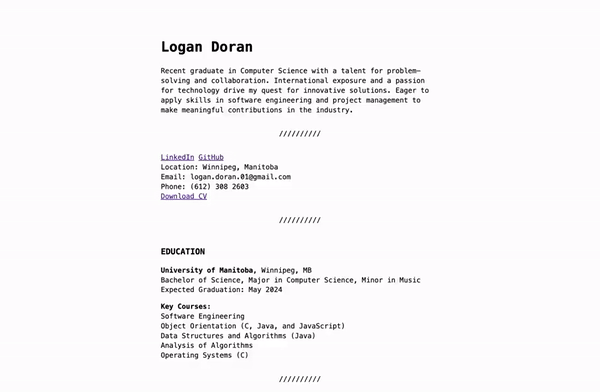

# Hosting Your Resume on GitHub Pages
## Purpose
This README provides instructions for hosting a resume on GitHub Pages while demonstrating technical writing principles from "Modern Technical Writing" by Andrew Etter.   

## Prerequisites
To follow this guide, you need:
- A resume formatted in Markdown
- A GitHub account
- Basic knowledge of Markdown syntax

For a Markdown tutorial, see the '[more resources](#more-resources)' section below.
## Instructions

### Step 1: Set Up GitHub Pages
Hosting your resume on a distributed version control system, such as GitHub, allows for version control and collaboration on the site.
1. Log in to your GitHub account.
2. Create a new repository with the name `username.github.io`, replacing `username` with your GitHub username.
3. Upload your Markdown resume file to this repository.

### Step 2: Configure Repository Settings
1. In your repository, go to the "Settings" tab.
2. Scroll down to the "GitHub Pages" section.
3. Under "Source," choose the branch where you have your resume file (usually "main" or "master").
4. Click "Save."

### Step 3: Customize Your Resume
Utilize Jekyll as a static site generator for efficient document formatting.
1. Create a `_config.yml` file: In your repository, create a file named `_config.yml` if one does not already exist.
2. Add theme configuration: Inside the `_config.yml` file, include the following line to specify the theme for your resume: `theme: [theme_name]`Replace `[theme_name]` with the name of the Jekyll theme you want to use. Alternatively, if you prefer to use a remote theme hosted on GitHub, use the following line: `remote_theme: [username/theme_name]` Replace `[username/theme_name]` with the GitHub username and theme repository name.
3. Save the changes: Commit the `_config.yml` file to your repository to apply the theme configuration.
4. Preview your resume: View your resume locally to see how the selected theme affects its appearance.
5. Customize further (optional): Explore additional customization options available for the chosen theme, such as color schemes, fonts, and layout configurations. Update the `_config.yml` file accordingly to reflect your preferences.

## More Resources
- [Markdown Tutorial](https://markdowntutorial.com/)
- [Markdown Guide](https://www.markdownguide.org/)
- [GitHub Pages Documentation](https://docs.github.com/en/pages)
- [Jekyll Documentation](https://jekyllrb.com/docs/)
- [Adding theme to GitHub Pages](https://docs.github.com/en/pages/setting-up-a-github-pages-site-with-jekyll/adding-a-theme-to-your-github-pages-site-using-jekyll)

## Authors and Acknowledgments
Special thanks to (person who does peer review) for their feedback and support.

## FAQs

### Why is Markdown better than a word processor?
Markdown offers a lightweight and easy-to-read syntax for formatting text without the distractions of complex word processors. It also integrates seamlessly with version control systems like Git.

### Why is my resume not showing up?
Ensure that your Markdown file is named correctly (`index.md`) and located in the correct repository branch. Also, check the repository settings to ensure GitHub Pages is enabled and configured correctly.
