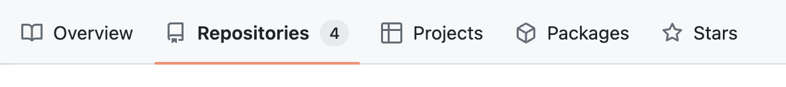
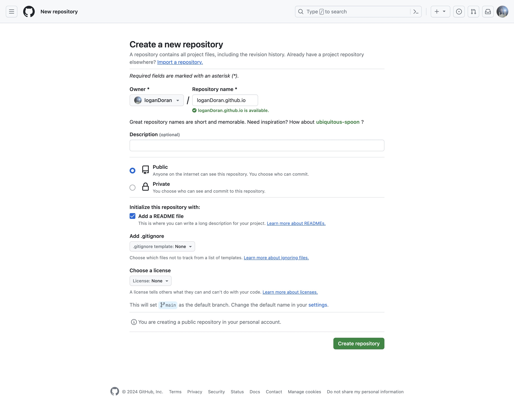
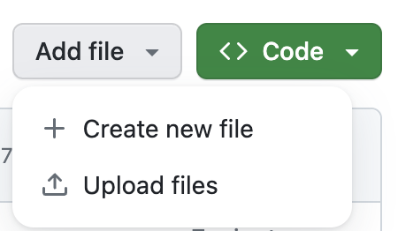
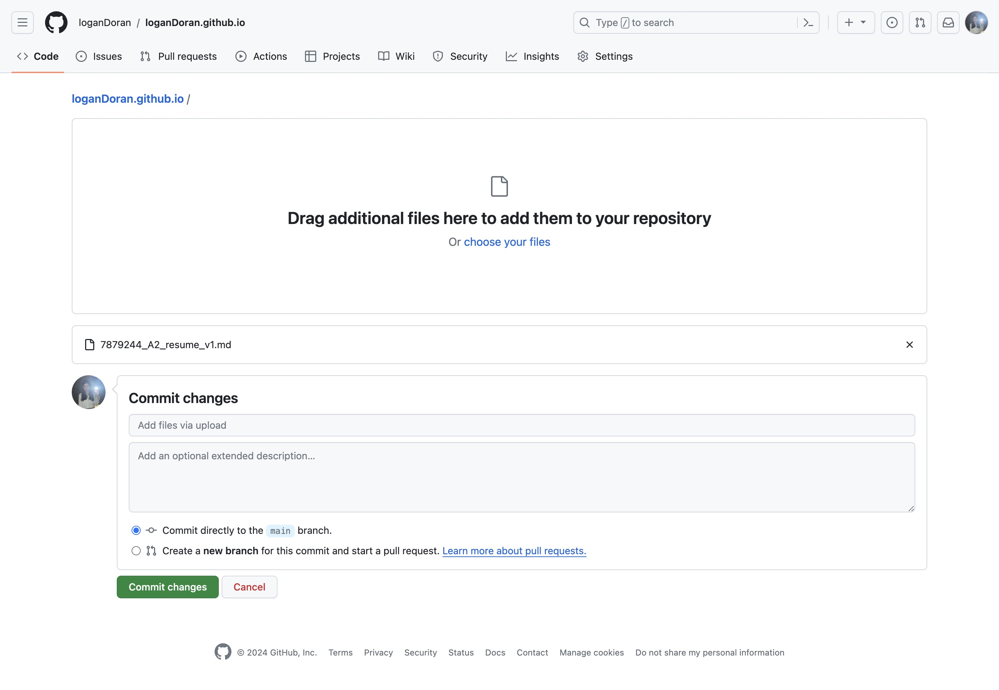
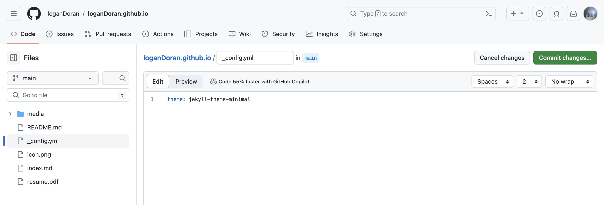
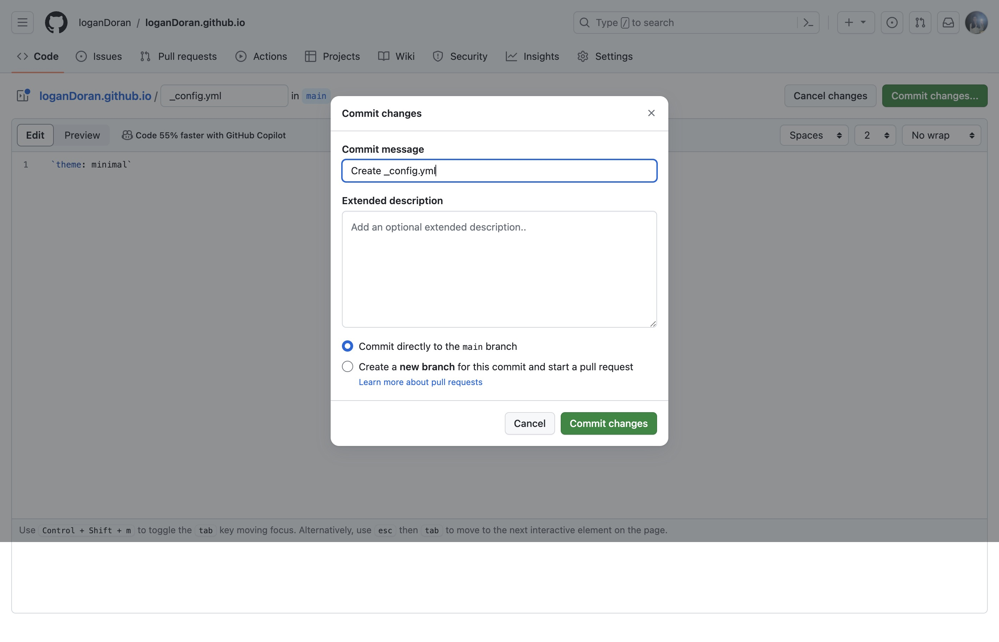

# Hosting Your Resume on GitHub Pages
## Purpose
This README provides instructions for hosting a resume on GitHub Pages while demonstrating technical writing principles from "Modern Technical Writing" by Andrew Etter.   

## Prerequisites
To follow this guide, you need:
- A resume formatted in Markdown
- A GitHub account
- Basic knowledge of Markdown syntax

For a Markdown tutorial, see the '[more resources](#more-resources)' section below.

## Instructions

### Step 1: Set Up GitHub Pages
1. Log in to your GitHub account.
2. Navigate from your main profile page to your repositories.   

3. Click the 'new' button to create a new repository.   

4. Name the repository `username.github.io`, replacing `username` with your GitHub username.
5. Select 'public' so your repository is findable.
6. Check the 'add a README file' box.
7. Click the 'create repository' button near the bottom of the page.

Hosting your resume on a distributed version control system, such as GitHub, allows for version control and collaboration on the site. This aligns with Andrew Etter's principle of using distributed version control systems to manage technical documentation.
<!-- share/host on a distributed control system -->

### Step 2: Upload your Markdown formatted resume
1. Click the 'add file' button on the main page of your new repository.
2. Select 'upload files' from the 'add file' drop down.   

4. Drag your Markdown file containing your into the large box on the screen.
5. Click the 'commit changes' button near the bottom page.

Markdown, a lightweight markup language recommended by Etter in "Modern Technical Writing," allows for easy formatting of text without dealing with unnecessary complexity. It enhances readability and simplifies the document creation process.
<!-- use a lightweight markup language -->

### Step 3: Customize Your Resume
1. Click the 'add file' button on the main page of your repository.   
2. Select the 'create file' from the 'add file' drop down.   

4. Change the name of this file to `_config.yml`. Right below the navigation bar there is a text box to enter your file name.
5. Include the following line in this file to specify the theme for your resume: `theme: jekyll-theme-[theme_name]` Replace `[theme_name]` with the name of the Jekyll theme you want to use. (You can explore the available themes [here](https://pages.github.com/themes/)).
7. Commit the `_config.yml` file to your repository by clicking 'commit changes...' near the top right of the page.

9. Click 'commit changes' in the next pop up.

Formatting a document with a static site generator, such as Jekyll, enables consistent and professional-looking presentation of your resume, aligning with the principles Etter outlines in his book.
<!-- Format a document with a static site generator -->

### Optional: Explore Remote Themes
You can add a more customized appearance to your resume by exploring remote themes available for Jekyll.

1. Visit the [Jekyll Themes](https://jekyllrb.com/docs/themes/) page to see available themes.
2. Choose a theme that fits your preferences and copy its repository URL.
3. In your `_config.yml` file, add the following line: `remote_theme: [repository_owner]/[repository_name]`, replacing `[repository_owner]` with the name of the user that published the repository, and replace `[repository_name]` with the name of the themes repository.
4. Save the `_config.yml` file and commit the changes to your repository.

Exploring remote themes allows you to enhance the visual appeal of your resume while keeping the benefits of static site generation, in line with the principles advocated by Andrew Etter in "Modern Technical Writing."

### Demo
Minimal theme              |  'No Theme Please' theme
:-------------------------:|:-------------------------:
 |  

## More Resources
- [Markdown Tutorial](https://markdowntutorial.com/)
- [Markdown Guide](https://www.markdownguide.org/)
- [GitHub Pages Documentation](https://docs.github.com/en/pages)
- [Jekyll Documentation](https://jekyllrb.com/docs/)
- [Adding theme to GitHub Pages](https://docs.github.com/en/pages/setting-up-a-github-pages-site-with-jekyll/adding-a-theme-to-your-github-pages-site-using-jekyll)

## Authors and Acknowledgments
**Authors**: Logan Doran   
**Acknowledgments**:    
An acknowledgement to Andrew Etter and his book Modern Technical Writing as it was used to support much of this README.   
A thank you to Riccardo Graziosi and all other contributers to the remote-theme 'No Style Please' for the creation and support of the theme used on my resume.   
Finally, a special thanks to my group in COMP 3040 for their feedback and support.

## FAQs

### Why should I choose Markdown over a word processor?
Markdown provides a lightweight and intuitive syntax for text formatting, free from the clutter and complexity of traditional word processors. Additionally, it seamlessly integrates with version control systems such as Git, promoting collaborative editing and easy tracking of document changes.

### Why isn't my resume appearing?
To ensure your resume displays correctly, follow these steps:
- Confirm that your Markdown file is named `index.md`.
- Verify that the file is located in the appropriate branch of your repository.
- Check your repository settings to ensure that GitHub Pages is activated and configured properly.
